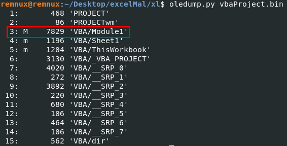

# TCM Security Academy
# Practical Malware Analysis & Triage
# Documentos Ofimáticos Maliciosos

---

# Índice

1. [Contenido del xlsm](#xlsm)
2. [Contenido del .bin](#bin)
3. [Conclusiones](#conclusiones)

---

**Herramientas**

Análisis estático:
- oledump.py

---

# Análisis estático

## Contenido del xlsm 

Imagínate la siguiente situación: eres la persona a cargo de la facturación de tu empresa y recibes un correo de un supuesto cliente en el que te manda un archivo excel adjunto en el cual, según te escribe, están los montos correspondientes a las compras del mes. Descargas el archivo, das doble click para abrirlo y desactivas las medidas de seguridad del Office para que puedas manipular el documento. En ese momento, estás permitiendo que las macros embebidas en el documento hagan su trabajo.

Y es que en los documentos de Office hay más de lo que podemos ver a simple vista. Primero (y es lo que veremos en este ejemplo), la extensión de un archivo Office, cuando tiene una macro dentro, viene con una "m" en la extensión: en este caso el nombre del archivo es "sheetsForFinancial.xlsm".

De manera general, un simple archivo Office contiene un montón de otros archivos o ficheros. Es decir, podemos pensar un archivo de estos como una carpeta donde tiene dentro otros ficheros.

Si descomprimimos el excel del ejemplo podremos ver que dentro tiene lo siguiente:

De primeras, para el analista de malware podría saltarle a la vista que dentro hay un fichero ".bin", el cual indica que hay un binario embebido en el excel.

## Contenido del .bin 

Analizando el contenido de este fichero, con la herramienta oledump[^1], se puede ver que ésta detectó la presencia de una macro[^2] la cual, siendo paranoico, el analista podría pensar que es una macro maliciosa:

Para determinar el riesgo de esa macro, mostramos su contenido. Normalmente, lo que encontraremos son un montón de strings contenidas dentro del ".bin". A simple vista, algunas podrían llamarnos la atención, aunque esto podría varias dependiendo de qué tan ofuscada o no podría estar la macro. En este ejemplo se pueden ver algunas cosas interesantes:

Intentemos recuperar la sintaxis de la macro para ver si podemos visualizar con más claridad lo que esta macro puede hacer:

Parece ser que la macro embebida dentro del documento xlsm analizado tiene la capacidad de hacer lo siguiente:

1. Crea una subrutina en la que crea un objeto "Adodb.Stream".
2. Luego hace una petición http por el método GET por el recurso "abc123.crt" a "http://srv3.wonderballfinancial.local/abc123.crt".
3. El cual es guardado como "encd.crt".
4. Después, mediante el emulador de comandos y la utilidad certutil, decodifica el fichero recién guardado y el contenido lo mete a un fichero que nombre "run.ps1" el cual lee desde una PowerShell en modo oculto.

# Conclusiones 

Al margen de lo que este archivo xlsm pueda hacer, la macro embebida implica un riesgo si se abre de manera descuidada.
Por otra parte, por la descripción del análisis realizado, podría parecer que solamente con tener en cuenta si la extensión del documento ofimático que querramos abrir contiene la letra "m" en su nombre, lo cual sería un indicativo de que contiene una macro, sería suficiente para descartar cualquier riesgo. Sin embargo, algunos documentos ofimáticos que no tienen explícitamente este indicativo también podrían o contener macros o script potencialmente maliciosos.

?raw=true

---
[^1]: OLE significa "Object Linking & Embedding" el cual es un protocolo desarrollado por Microsoft. Este protocolo, básicamente, permite que las aplicaciones de los diferentes docuementos Office tengan una interacción enriquecida como arrastrar tablas de excel a un documento word. Para saber más: https://es.wikipedia.org/wiki/Object_Linking_and_Embedding
[^2]: oledump es un programa hecho en python que permite analizar documentos OLE desde la cual se puede ver la información de estos documentos. Dentro de sus funcionalidades, detecta cuando en el documento analizado hay macros: un indicativo de esto es cuando a la derecha del índice "A3" hay una letra m mayúscula "M". Para saber más ver: https://blog.didierstevens.com/programs/oledump-py/

