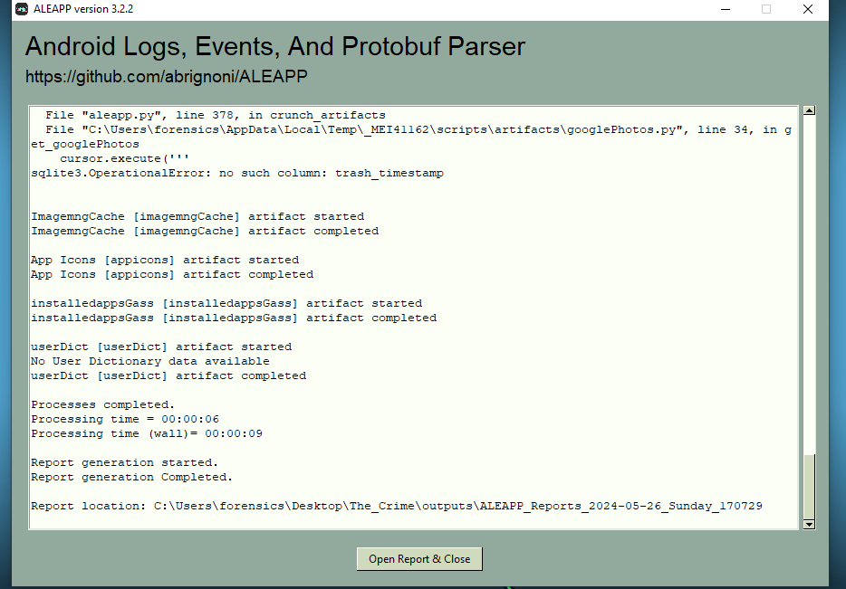
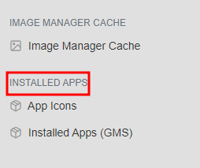
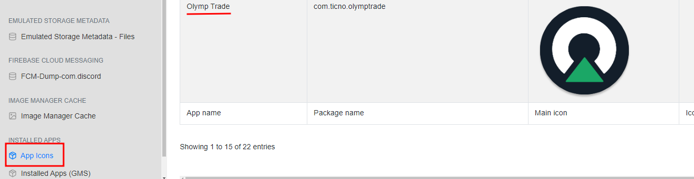
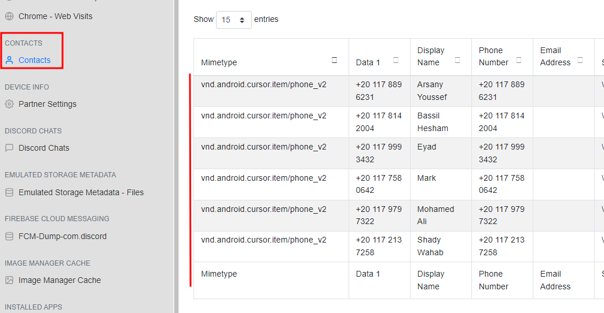
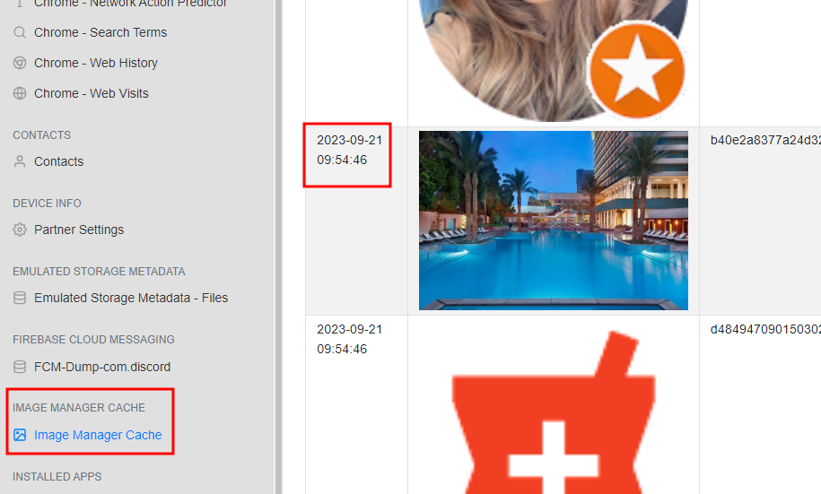

Esta es una guía de cómo resolver, paso a paso, el reto The Crime de la plataforma Cyberdefenders.org

Tags: Writeups, Writeups Español, Cyberdefenders, The Crime, End Point Forensics

## Escenario

Actualmente estamos en medio de una investigación de un asesinato, lo que obtuvimos como evidencia es el teléfono de la víctima. Después de realizar entrevistas con los testigos y el círculo cercano de la víctima, tu objetivo es analizar meticulosamente la información que hemos recolectado y, diligentemente, identificar la evidencia para formar la secuencia de eventos que llevaron al incidente.

# Índice

1. [Preámbulo](#pre)
2. [Introducción](#intro)
3. [Write Up](#wu)\\
    3.1 [Pregunta 1](#p1)\\
    3.2 [Pregunta 2](#p2)\\
    3.3 [Pregunta 3](#p3)\\
    3.4 [Pregunta 4](#p4)\\
    3.5 [Pregunta 5](#p5)\\
    3.6 [Pregunta 6](#p6)
4. [Preguntas y respuestas](#pyr)
5. [Recomendación](#rec)

# Preámbulo 

<html>
<body>

</body>
</html>

|Info|Descripción|
|----|-----------|
|Reto|The Crime|
|SHA1SUM|3eb40fd0257dd3bf7d7513e1423e54c8fced4706|
|Autor|InfernOo|
|Tags|Android, ALEAPP, SQLite Browser|

# Herramientas

**Recomendadas**
- ALEAPP
- SQLite Browser
- Autopsy Forensics (intenta con esta herramienta)

# Introducción 

**Entendiendo nuestra evidencia**

Lo que el laboratorio nos ofrece es lo que parece una copia forense del dispositivo del supuesto crimen. Esto se puede corroborar con la información que nos regalan en las Referencias del ejercicio, la cual nos lleva a un perfil de GitHub en donde se puede ver la estructura de un SO Android.

Pese a que nos recomiendan usar la herramienta ALEAPP, yo tuve algunos problemas para importar y extraer una cantidad relevante de información. Como alternativa, puedes usar la herramienta Autopsy Forensics que igualmente es de código abierto y se puede usar de manera gratuita.

En cuanto a la estructura de la información que nos llega a las manos, como cualquier copia forense, hay un montón de carpetas, sub carpetas y ficheros. Puedes explorar lo que hay, lo cual es recomendable por si nunca habías visto cómo se ve un Android desde dentro, o puedes importar la copia al ALEAPP de una y ver qué te arroja.

# Write Up 

**1. Basado en las relatorías de los testigos e individuos cercanos a la víctima, se hizo evidente que la víctima estaba interesada en le trading. Esto lo llevó a invertir todo su dinero y adquirir dedudas. ¿Puedes identificar qué aplicación de trading usaba principalmente la víctima en su teléfono?** 

La primera pregunta se puede responder mirando las aplicaciones instaladas en el dispositivo. Lo que la GUI de la herramienta nos ofrece es una serie de secciones de la información que pudo obtener. Así, hay una sección de “installed apps”. Si nos vamos a la parte de “app icons” veremos las típicas aplicaciones de sistema de un android más, la que nos interesa, que es una app llamada “Olymp Trade”.

Vale la pena tener en cuenta que, si nos vamos a la sección de “installed apps (gms)”, veremos otras aplicaciones que no son las del sistema. En un caso real, es importante tener esta información pues, eventualmente, querríamos saber con quién estuvo intercambiando mensajes nuestra víctima: una de las aplicaciones sobre las cuales hay que tener un ojo puesto es el “discord”.

**2. De acuerdo con el testimonio del mejor amigo de la víctima, él dijo "Cuando estábamos juntos, mi amigo recibió varias llamadas que no contestó. Dijo que debía mucho dinero a quien le llamaba pero que no le podía pagar", ¿Cuánto dinero le debe a esta persona?** 

En la segunda pregunta se nos pide averiguar cuánto dinero le debía la víctima a quienquiera que le debía ese dinero. Para responder a esta pregunta necesitamos, primero, saber con quién tuvo comunicaciones.

En un caso real, y teniendo una buena metodología de investigación, quizá el primer paso sería (en la medida de lo posible) recopilar la agenda de contactos de la víctima, luego el registro de llamadas haciendo énfasis en las comunicaciones en el “día clave”. Atendiendo a esto recién dicho, en la copia de seguridad se puede obtener que los contactos registrados en el dispositivo son los siguientes:

Seis contactos registrados en total, de los cuales no sabemos quien es nuestro perpetrador. El siguiente paso lógico, como ya mencioné, sería ir al registro de llamadas, sin embargo, y debo ser honesto admitiendo que no estoy seguro si se deba a cómo importé la copia al ALEAPP, pero desde allí no se puede visualizar el registro de llamadas. Al margen de lo anterior, explorando los ficheros de la evidencia hay uno llamado “calllog.db” en el que se encuentra esta información. La ruta absoluta a este fichero es: data\data\com.android.providers.contacts\databases\

Ya tenemos el registro de llamadas y ya sabemos quién fue el contacto que más veces intentó llamarle, lo cual nos da una pista sobre quién podría ser el perpetrador: “Shady Wahab”. Más tomando en cuenta que el testimonio de la persona cercana a la víctima menciona que éste intentó marcarle varias veces , no tomó la llamada porque quien le marcaba era la persona a la que le debía dinero. Tenemos al posible responsable pero no la cantidad de dinero que le debía. Lo más sensato fue buscar mensajes donde se pudiera encontrar esa información, o quizá una imagen simulando una captura de pantalla donde se viera la cantidad. Sin embargo, no encontré nada.

Lo que queda claro es que la herramienta ALEAPP no nos va a dar todo. Después de estar buscando entre las carpetas información que pudiera ser útil, encontré  una llama “com[.]google.android.apps.messaging\databases” y allí un fichero llamado “bugle_db”. A ese fichero le cambié el nombre para que fuese “bugle.db” y, desde el SQLIte Web, tras importar el fichero, pude ver el mensaje proveniente de Shady Wahab diciéndole que no le está tomando las llamadas y que es hora de que le pague los $250,000 EGP que le debe.

**3. ¿Cuál es el nombre de la persona a la cual la víctima le debía dinero?** 

El nombre del perpetrador lo encontramos desde la pregunta pasada: es Shady Wahab.

**4. Basado en la relatoría de los familiares de la víctima, dijeron que el 20 de septiembre del 2023, la víctima partió de su residencia sin informar a nadie a dónde iba. ¿En dónde estaba alojada la víctima en ese momento?** 

Para esta pregunta, revisé las imágenes que pude obtener con e ALEAPP y encontré una de un hotel. Los metadatos se ve que la imagen es del 21 de septiembre, pero de igual manera hice una búsqueda inversa de imágenes en Google y me apareció el nombre del hotel: The Nile Ritz-Carlton.

**5. El detective continuó su investigación haciendo preguntas en el lobby del hotel. Le informaron que la víctima había reservado la habitación por 10 días y que tenía un vuelo reservado. El investigador cree que la víctima podría tener almacenada información sobre el boleto de avión en su teléfono. Mira a donde quería volar la víctima.** 

Esta pregunta la dejé hasta el final porque no encontraba ninguna imagen como sugería la pregunta misma. Después de un rato, intentar varias cosas distintas y llegar a frustrarme, tras intentar volver a importar la evidencia en el ALEAPP desde el archivo comprimido y que me salieran varios errores, descomprimí la carpeta “data” y la volví a comprimir en un zip din contraseña e importarla de nuevo. Después de esto, el ALEAPP me dio más información que antes donde se también estaba la imagen del boleto de avión. El destino al que nuestra víctima quería volar era Las Vegas.

**6. Después de examinar las conversaciones de Discord de la víctima, descubrimos que había agendado un encuentro con un amigo en un lugar específico. ¿Puedes determinar dónde debía ocurrir esa reunión?** 

La siguiente pregunta es más sencilla, en los chats de Discord, el usuario “rob1ns0n.” Le manda un mensaje diciéndole que se van a ver en el “The Mob Museum”. Este mensaje lo recibió el 20 de septiembre del 2023 a las 20:46 horas.

# Preguntas y respuestas 

1. Basado en las relatorías de los testigos e individuos cercanos a la víctima, se hizo evidente que la víctima estaba interesada en le trading. Esto lo llevó a invertir todo su dinero y adquirir dedudas. ¿Puedes identificar qué aplicación de trading usaba principalmente la víctima en su teléfono?\\
**R: Olymp Trade**

2. De acuerdo con el testimonio del mejor amigo de la víctima, él dijo "Cuando estábamos juntos, mi amigo recibió varias llamadas que no contestó. Dijo que debía mucho dinero a quien le llamaba pero que no le podía pagar", ¿Cuánto dinero le debe a esta persona?\\
**R: 250,000.00 EGP**

3. ¿Cuál es el nombre de la persona a la cual la víctima le debía dinero?\\
**R:Shady Wahab**

4. Basado en la relatoría de los familiares de la víctima, dijeron que el 20 de septiembre del 2023, la víctima partió de su residencia sin informar a nadie a dónde iba. ¿En dónde estaba alojada la víctima en ese momento?\\
**R: The Nile Ritz-Carlton**

5. El detective continuó su investigación haciendo preguntas en el lobby del hotel. Le informaron que la víctima había reservado la habitación por 10 días y que tenía un vuelo reservado. El investigador cree que la víctima podría tener almacenada información sobre el boleto de avión en su teléfono. Mira a donde quería volar la víctima.\\
**R: Las Vegas**

6. Después de examinar las conversaciones de Discord de la víctima, descubrimos que había agendado un encuentro con un amigo en un lugar específico. ¿Puedes determinar dónde debía ocurrir esa reunión?\\
**R: The Mob Museum**

# Recomendación 

Pensé en esta solución cuando estaba caminando por la calle para tomar un descanso de este ejercicio. Una manera de visualizar y obtener la mayoría, si no toda la información para resolver todas la preguntas, es usando el Autopsy Forensics. Si te sientes atorado en esta laboratorio, usa esta herramienta.
