Esta es una guía de cómo resolver, paso a paso, el reto Insider de la plataforma Cyberdefenders.org

Tags: Writeups, Writeups Español, Cyberdefenders, Insider, End Point Forensics

# Preámbulo 

<html>
<body>

</body>
</html>

|Info|Descripción|
|----|-----------|
|Reto|Insider|
|SHA1SUM|d820264d825fdaeb2146bf7b4c4e03684e700007|
|Autor|Champlain College|
|Tags|Linux, FTK Imager, Disk Forensics|

# Índice

1. [Preámbulo](#pre)\\
    1.1 [Mitre ATT&CK](#mitre)
2. [Writeup](#wu)\\
    2.1 [Pregunta 1](#p1)\\
    2.2 [Pregunta 2](#p2)\\
    2.3 [Pregunta 3](#p3)\\
    2.4 [Pregunta 4](#p4)\\
    2.5 [Pregunta 5](#p5)\\
    2.6 [Pregunta 6](#p6)\\
    2.7 [Pregunta 7](#p7)\\
    2.8 [Pregunta 8](#p8)\\
    2.9 [Pregunta 9](#p9)\\
    2.10 [Pregunta 10](#p10)\\
    2.11 [Pregunta 11](#p11)
3. [Preguntas y respuestas](#pyr)

# Herramientas

**Recomendadas**
- FTK Imager

+++++++++++++++++++++++++++++++++++++++++++++++++++++++++++++++++++++++++++++++++++++++++++++++++++++++++++

# Escenario 

Después de que Karen empezó a trabajar en TAAUSAI, empezó a hacer algunas actividades ilegales dentro de la compañía. TAAUSAI te contrató como analista SOC para iniciar una investigación en este caso. Adquiriste una imagen del disco de la computadora de Karen y encontraste que usa Linux en su máquina. Analiza la imagen del disco de la computadora de Karen y responde a las preguntas que se te dan.

# Preámbulo 

Siempre es bueno leer primero las preguntas de la máquina que vamos a realizar, ya que éstas nos dan una pista de a lo que nos vamos a enfrentar y lo que vamos a tener que buscar dentro de nuestra evidencia.En un caso real, naturalmente, las cosas son más complicadas: a veces nos pueden llegar nuestros clientes (o personas que nos contratan) y simplemente decirnos “sospechamos que Karen está haciendo cosas raras”. ¿Qué demonios significa “cosas raras”? En otras ocasiones, podrán llegar y decirnos “Karen en una persona conflictiva para la empresa, además de que sospechas de que ha estado haciendo cosas ilegales”. Bajo estas, o cualquier situación similar en donde, además, no hay preguntas a responder que nos den una pista por dónde empezar a buscar, la pregunta que nos tenemos que hacer es ¿en dónde busco lo que sea que me sirva? Bueno, pues la respuesta a esta pregunta es: no hay respuesta universal. La experiencia a veces nos da pautas y metodologías para arrancar una investigación. Sin embargo, algo que también es importante ejercitar y pulir, hay que escuchar a nuestros clientes de manera atenta y detallada. Si este fuera un caso real, que el cliente nos diga “”uno de nuestros empleados nos dijo que estuvo siendo hostigado por Karen” nos sirve como indicio para empezar a buscar. Las preguntas de estos laboratorios nos dan una especie de camino a seguir; en la vida real es probable que lo primero que encontremos es la pieza final del rompecabezas. Al margen de lo anterior, yo siempre empezaré por identificar qué es lo que tengo en las manos, qué evidencia tengo disponible y qué puedo hacer con ella; además de la siempre importante cuestión:qué herramientas puedo usar para lograr mis objetivos.

Así, pues, iniciemos por el reconocimiento de nuestra evidencia. Cuando abrimos nuestra evidencia, lo que veremos es un fichero de extensión “ad1” el cual, de acuerdo con la IA de mi navegador de confianza (Brave) es: “una extensión de archivo utilizada por el Kit de herramientas forenses Imagen (FTK Imager) de AccessData, una empresa de software de análisis forense. El archivo AD1 es una imagen forense que contiene datos binarios ilegibles, que solo pueden ser leídos e interpretados por los programas asociados.” Así, pues, parece que tendremos que usar la herramienta FTK Imager para poder visualizar lo que sea que haya dentro (tal y como nos lo recomienda el laboratorio). Por otra parte, hay un fichero de texto (txt) con información sobre la copia del disco realizada, información que en un caso real es crucial aunque en este ejercicio no relevante.

+++++++++++++++++++++++++++++++++++++++++++++++++++++++++++++++++++++++++++++++++++++++++++++++++++++++++++

## Mitre ATT&CK 

Antes de arrancar de lleno con la investigación, vale la pena detenernos una vez más para entender por completo la información que nos ofrecen en las categorías del laboratorio. Me refiero a los códigos T1496, T1059, T1005 y T1003. Pues no se trata de otra cosa que un código que la empresa Mitre asigna al tipo particular de ataque, técnica, técnicas o procedimientos  de los cibercriminales (TTP por sus siglas en inglés Tactics, Techniques, and Procedures). En la web oficial de [Mitre ATT&CK](https://attack.mitre.org/) podemos obtener una descripción de estas prácticas de acuerdo con su clasificación. De esta manera, pues, los códigos que nos dan refieren a lo siguiente (traducciones con ChatGPT).

[T1496](https://attack.mitre.org/techniques/T1496/)

Secuestro de Recursos (Resource Hijacking)

"Los adversarios pueden aprovechar los recursos de sistemas coptados para completar tareas intensivas en recursos, lo que puede afectar la disponibilidad del sistema y/o del servicio hospedado.

Un propósito común para el Secuestro de Recursos es validar transacciones de redes de criptomonedas y ganar moneda virtual. Los adversarios pueden consumir suficientes recursos del sistema para afectar negativamente y/o hacer que las máquinas afectadas se vuelvan no responsivas. Los servidores y los sistemas basados en la nube son objetivos comunes debido al alto potencial de recursos disponibles, pero los sistemas de usuarios finales también pueden ser comprometidos y utilizados para el Secuestro de Recursos y la minería de criptomonedas. Los entornos de contenedores también pueden ser atacados debido a la facilidad de implementación a través de APIs expuestas y al potencial de escalar actividades de minería desplegando o comprometiendo múltiples contenedores dentro de un entorno o clúster.

Además, algunos malware de minería de criptomonedas identifican y luego eliminan procesos de malware competidor para asegurarse de que no compiten por recursos.

Los adversarios también pueden usar malware que aproveche el ancho de banda de la red de un sistema como parte de una botnet para facilitar campañas de Denegación de Servicio de Red y/o sembrar torrents maliciosos. Alternativamente, pueden participar en proxyjacking vendiendo el uso del ancho de banda de la red y la dirección IP de las víctimas a servicios de proxyware."

[T1059](https://attack.mitre.org/techniques/T1059/)

Intérprete de Comandos y Scripts (Command and Scripting Interpreter)

"Los adversarios pueden abusar de los intérpretes de comandos y scripts para ejecutar comandos, scripts o binarios. Estas interfaces y lenguajes proporcionan formas de interactuar con los sistemas informáticos y son una característica común en muchas plataformas diferentes. La mayoría de los sistemas vienen con alguna capacidad integrada de línea de comandos y scripting, por ejemplo, macOS y las distribuciones de Linux incluyen alguna variante de Unix Shell, mientras que las instalaciones de Windows incluyen Windows Command Shell y PowerShell.

También existen intérpretes multiplataforma como Python, así como aquellos comúnmente asociados con aplicaciones cliente como JavaScript y Visual Basic.

Los adversarios pueden abusar de estas tecnologías de diversas maneras como un medio para ejecutar comandos arbitrarios. Los comandos y scripts pueden ser incrustados en cargas útiles de acceso inicial entregadas a las víctimas como documentos señuelo o como cargas útiles secundarias descargadas desde un C2 (Command and Control) existente. Los adversarios también pueden ejecutar comandos a través de terminales/shells interactivos, así como utilizar varios Servicios Remotos para lograr la ejecución remota."

[T1005](https://attack.mitre.org/techniques/T1005/)

Datos del Sistema Local (Data from Local System)

"Los adversarios pueden buscar en las fuentes del sistema local, como sistemas de archivos y archivos de configuración o bases de datos locales, para encontrar archivos de interés y datos sensibles antes de la exfiltración.

Los adversarios pueden hacer esto utilizando un intérprete de comandos y scripts, como cmd, así como una interfaz de línea de comandos de dispositivos de red (Network Device CLI), que tienen la funcionalidad para interactuar con el sistema de archivos y recopilar información. Los adversarios también pueden utilizar la recopilación automatizada en el sistema local."

[T1003](https://attack.mitre.org/techniques/T1003/)

Volcado de Credenciales del Sistema Operativo (OS Credential Dumping)

"Los adversarios pueden intentar volcar credenciales para obtener información de inicio de sesión de cuentas y material de credenciales, normalmente en forma de un hash o una contraseña en texto claro. Las credenciales pueden obtenerse de cachés del sistema operativo, memoria o estructuras. Luego, las credenciales pueden ser utilizadas para realizar movimientos laterales y acceder a información restringida.

Varios de las herramientas mencionadas en sub-técnicas asociadas pueden ser utilizadas tanto por adversarios como por evaluadores de seguridad profesional. Es probable que también existan herramientas personalizadas adicionales."

Recomiendo enormemente	que le eches un ojo a la web de Mitre para que te familiarices con los recursos, información y documentación que ofrece la plataforma, ya que hay mucho que aprender allí, además de que es una fuente de información fiable e internacionalmente soportada por muchos investigadores.

+++++++++++++++++++++++++++++++++++++++++++++++++++++++++++++++++++++++++++++++++++++++++++++++++++++++++++

# Writeup 

**Cómo abrir la evidencia en el FTK Imager**

Por si es la primera vez que usa FTK Imager, te voy a describir cómo abrir el fichero “ed1” que viene en la evidencia. Tan solo hay que darle a “Add Evidence Item”, seleccionar la ruta donde tengas almacenada el “ad1” y listo. Verás algo como esto una vez que todo esté listo:

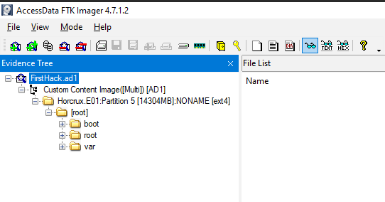

**1. ¿Qué distribución de Linux se está utilizando en esta máquina?** 

Explorando el directorio “boot” podemos ver varios ficheros que nos dicen la distribución de Linux de la computadora de la investigada. El directorio “boot” es fundamental para el arranque del sistema operativo de las máquinas Linux, por lo que es lógico que dentro de este directorio encontremos información sobre la distribución concreta de la máquina.

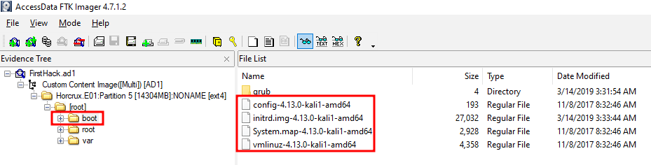

**2. ¿Cuál es el hash MD5 del archivo apache access.log?** 

La pregunta misma ya no está diciendo lo que tenemos que buscar: el servidor web apache. En el directorio “var” se almacenan ficheros y otros directorios que necesitan escribir y sobre escribir con frecuencia ciertos ficheros, como los “logs”. Así, dentro de “var/log” hay un directorio llamado “apache2”, allí vamos a encontrar el log del programa. Lo que yo hice para obtener el hash MD5 fue extraer el fichero (click derecho “Export Files) y, desde la powershell de Windows, obtuve el MD5 con el siguiente comando:

´Get-FileHash ruta-al-fichero/acces.log -Algorithm MD5´

Y obtenemos: D41D8CD98F00B204E9800998ECF8427E

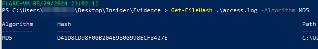

**3. Se cree que se descargó una herramienta de volcado de credenciales. ¿Cuál es el nombre de la descarga?** 

Aquí la respuesta es relativamente sencilla. Si pensamos en un programa que se descarga, lo natural es buscar en el directorio de descargas. Dado que el directorio “root” es, salvando las distancias, equivalente a “MiPC” de Windows, dentro de “root” encontraremos nuestra carpeta. Si buscamos allí encontraremos un zip del programa “mimikatz_trunk.zip” que es el programa que buscamos.

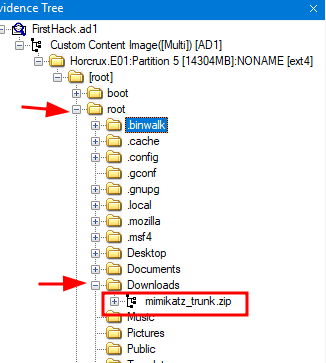

Como curiosidad, mimikatz “es capaz de extraer contraseñas en texto claro, hashes, códigos PIN y tickets de Kerberos de la memoria. Además, puede realizar ataques de pass-the-hash, pass-the-ticket o crear Golden tickets, y jugar con certificados o claves privadas, bóvedas y más”. Una herramienta básica para los especialistas en seguridad ofensiva.
 

**4. Se creó un archivo súper secreto. ¿Cuál es la ruta absoluta?** 

Lo primero que se me ocurrió fue buscar “manualmente” en las carpetas del sistema, es decir, en los subdirectorios del “root”, sin embargo, no encontré nada por la simple razón de que el fichero pudo haber sido eliminado y que no estuviera visible. Luego, lo que se me ocurrió revisar el historial de comandos introducidos en la consola del sistema y allí encontré que el fichero “SuperSecretFile.txt” fue creado con el comando “touch”:

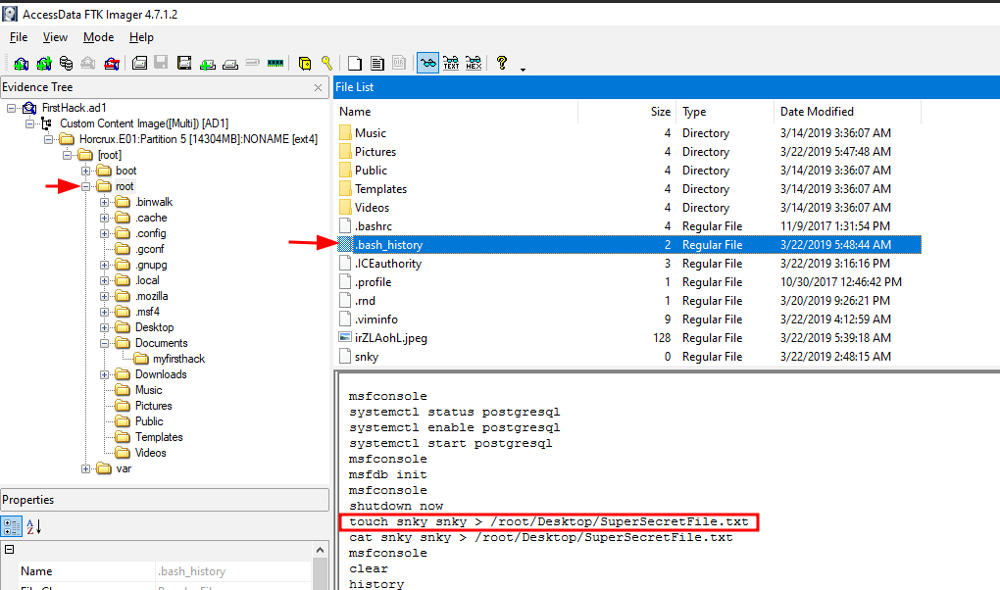

**5. ¿Qué programa utilizó didyouthinkwedmakeiteasy.jpg durante la ejecución?** 

En el mismo historial de la bash encontramos el comando del programa utilizado para abrir la imagen jpg:

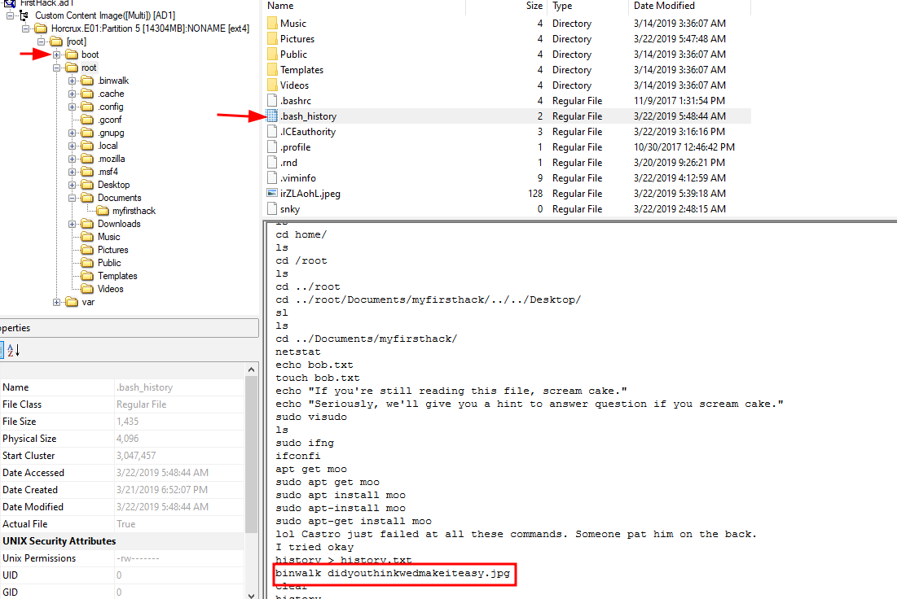

**6. ¿Cuál es el tercer objetivo de la lista de tareas que creó Karen?** 

Para esta pregunta no encontré algún fichero que se llamara “Checklist” o algo similar, así que busqué “manualmente” un archivo que me diera un indicio y me encontré un fichero “Cheklist” con la respuesta dentro de la carpeta de Escritorio (Desktop): Profit.

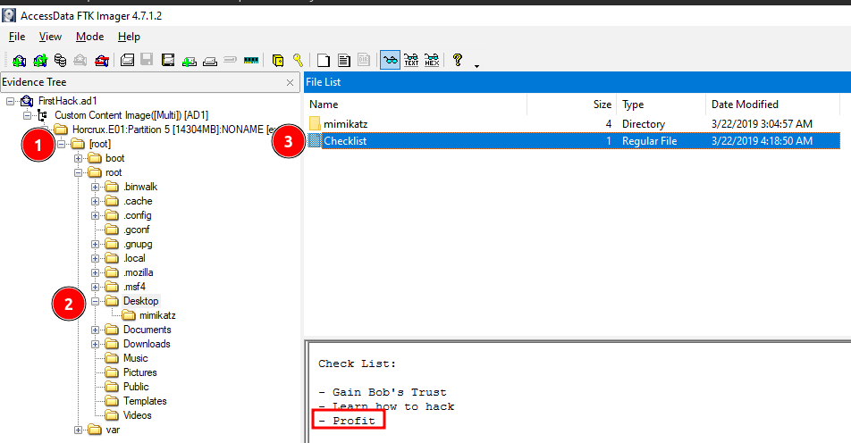

**7. ¿Cuántas veces se ejecutó Apache?** 

Como ya habíamos visto en la pregunta dos, hay un fichero que se llama “access.log” dentro del programa de apache. Cuando te diriges a ese archivo, podemos ver que no nos muestra información. Al principio pensé que era un problema de exportación o algo similar, pero a veces las respuesta son más sencillas: si no hay información en los logs es porque quizá nunca se inició el programa, es decir, el número de veces que se ejecutó el apache es: 0.

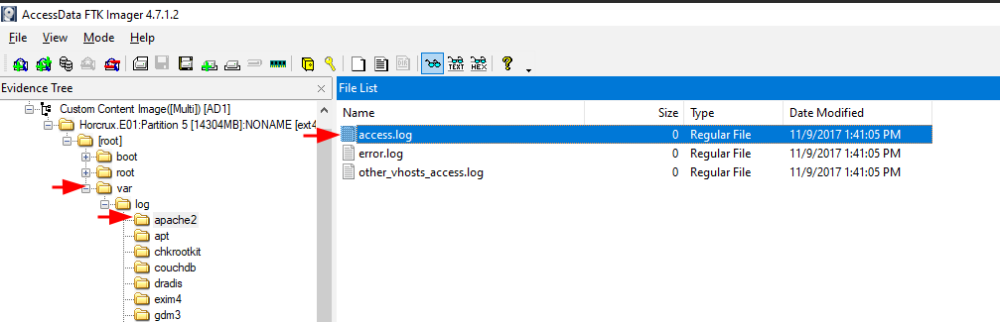

**8. Se cree que esta máquina se usó para atacar a otra. ¿Qué archivo prueba esto?** 

Esta pregunta es compleja, aunque quizá no difícil. La complejidad reside en qué documento estamos buscando. Con esta información tan limitada cualquier tipo de documentos nos valdría. Mi razonamiento para seguir esta pregunta fue buscar en los archivos almacenados del usuario. Cuando abres el directorio de ”root” podremos ver las subcarpetas y un archivo que me llamó mucho la atención: “irZLAohL.jpeg”. Al abrir la imagen se ve lo que casi con seguridad es una captura de pantalla de un escritorio de una máquina Windows con una cmd abierta con dos cosas relevantes:

(1) En la cmd se ve que Karen se dirigió a la ruta: “C:\Users\Bob\AppData\Local\Temp”, la cual sería una carpeta de sistema perfecto para almacenar algún programa malicioso.
(2) El siguiente comando es “aylmao[.]exe” que tiene nombre de ser un programa malicioso.

Con estos indicios podemos asumir frente a la evidencia que necesitamos para esta pregunta.

Como evidencia adicional -si esto fuera un caso real-, es un paso natural conseguir los hashes de la imagen que configura nuestra evidencia.

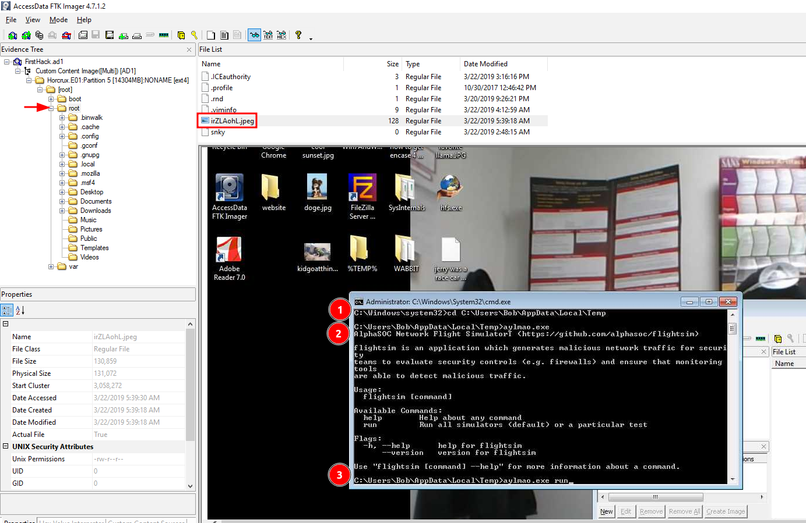

**9. Dentro de la ruta de archivos de Documentos, se cree que Karen estaba burlándose de un experto en computadoras a través de un script de bash. ¿De quién se estaba burlando Karen?** 

Esta pregunta ya está casi resuelta pues ya nos dan casi la dirección completo del fichero que hay que mirar. En este caso, dentro del único directorio dentro de Documentos, veremos 5 documentos y, donde está nuestra respuesta es en “firstscript_fixed”: la persona que estaba siendo molestada por Karen era “Young”.

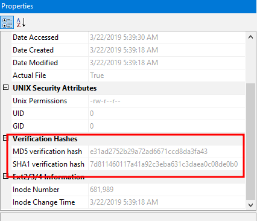

**10. Un usuario usó “su” para root a las 11:26 varias veces. ¿Quién fue?** 

Tratándose de un SO Linux y tratándose del comando “su” que se usa para cambiar de usuarios, es normal que donde tengamos que buscar la respuesta sea en el archivo “auth.log” que se encuentra en la ruta “var\log\”. Yo abrí el fichero en el Notepad++ y busqué por la hora que nos dan en la pregunta y allí encontré que hubo un cambio de usuario a “postgres”.

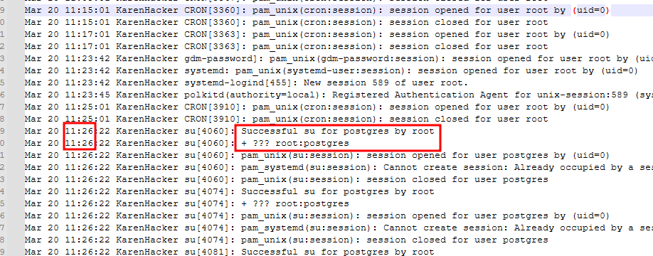

**11. Basado en el historial de bash, ¿cuál es el directorio de trabajo actual?** 

Por último, en cuando al registro de comandos para cambiar de directorio, esta información la podremos encontrar en el fichero “bash_history”. Allí veremos que la ruta actual es: “/root/Documents/myfirsthack/“.

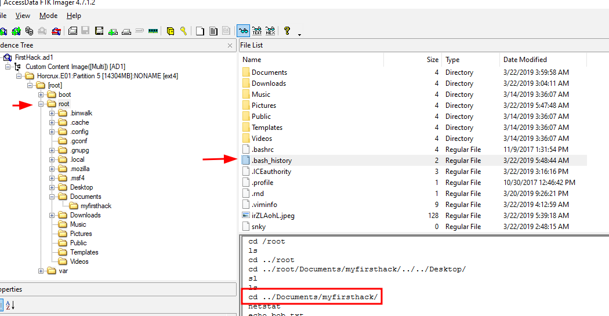

+++++++++++++++++++++++++++++++++++++++++++++++++++++++++++++++++++++++++++++++++++++++++++++++++++++++++++

# Preguntas y respuestas  

1. ¿Qué distribución de Linux se está utilizando en esta máquina?\\
**kali**

2. ¿Cuál es el hash MD5 del archivo apache access.log?\\
**D41D8CD98F00B204E9800998ECF8427E**

3. Se cree que se descargó una herramienta de volcado de credenciales. ¿Cuál es el nombre de la descarga?\\
**mimikatz_trunk.zip**

4. Se creó un archivo súper secreto. ¿Cuál es la ruta absoluta?\\
**SuperSecretFile.txt**

5. ¿Qué programa utilizó didyouthinkwedmakeiteasy.jpg durante la ejecución?

6. ¿Cuál es el tercer objetivo de la lista de tareas que creó Karen?\\
**Profit**

7. ¿Cuántas veces se ejecutó Apache?\\
**0**

8. Se cree que esta máquina se usó para atacar a otra. ¿Qué archivo prueba esto?\\
**irZLAohl.jpeg**

9. Dentro de la ruta de archivos de Documentos, se cree que Karen estaba burlándose de un experto en computadoras a través de un script de bash. ¿De quién se estaba burlando Karen?\\
**Young**

10. Un usuario usó su para root a las 11:26 varias veces. ¿Quién fue?\\
**postgres**

11. Basado en el historial de bash, ¿cuál es el directorio de trabajo actual?\\
**/root/Documents/myfirsthack/**

+++++++++++++++++++++++++++++++++++++++++++++++++++++++++++++++++++++++++++++++++++++++++++++++++++++++++++
