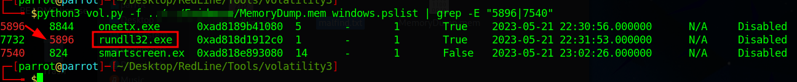

Esta es una guía de cómo resolver, paso a paso, el reto RedLine de la plataforma Cyberdefenders.org

Tags: Writeups, Writeups Español, Cyberdefenders, RedLine, End Point Forensics


# Preámbulo <a name="pre"></a>

<html>
<body>
<style>
table, th, td {
  border:1px solid black;
}
</style>
</body>
</html>

|Info|Descripción|
|:--:|:---------:|
|Reto|RedLine|
|SHA1SUM|7c54f50cefed2e2a8947368c0de41bbb665fe483|
|Autor|Ahmed Tammam|
|Tags|Memory Forensic, Volatility, RedLine, NIDS, T1055|


# Índice

1. [Preámbulo](#pre)\\
    1.1 [Mitre ATT&CK](#mitre)
2. [Writeup](#wu)\\
    2.1 [Pregunta 1](#p1)\\
    2.2 [Pregunta 2](#p2)\\
    2.3 [Pregunta 3](#p3)\\
    2.4 [Pregunta 4](#p4)\\
    2.5 [Pregunta 5](#p5)\\
    2.6 [Pregunta 6](#p6)\\
    2.7 [Pregunta 7](#p7)\\
    2.8 [Pregunta 8](#p8)
3. [Preguntas y respuestas](#pyr)


## Herramientas

**Recomendadas**
- Volatility

+++++++++++++++++++++++++++++++++++++++++++++++++++++++++++++++++++++++++++++++++++++++++++++++++++++++++++

# Escenario

Como miembro del Blue Team, tu tarea es analizar un volcado de memoria utilizando las herramientas Readline y Volatility. Tu objetivo es rastrear los pasos realizados por el atacante en la máquina comprometida y determinar cómo lograron evadir el Sistema de Detección de Intrusiones de Red (NIDS). Tu investigación implicará identificar la familia específica de malware utilizada en el ataque, junto con sus características. Además, tu tarea es identificar y mitigar cualquier rastro o huella dejada por los atacantes.

+++++++++++++++++++++++++++++++++++++++++++++++++++++++++++++++++++++++++++++++++++++++++++++++++++++++++++

## Mitre ATT&CK <a name="mitre"></a>

Como hemos visto en laboratorios pasados, en algunos de ellos nos ofrecen el código de la técnica de intrusión de los atacantes. En este caso el que nos dan es el T1055, según la web de Mitre, este ataque es una Inyección de Procesos (Process Injection), el cual consiste en lo que sigue:

“Los adversarios pueden inyectar código en los procesos para evadir las defensas basadas en procesos y, posiblemente, elevar privilegios. La inyección de procesos es un método para ejecutar código arbitrario en el espacio de direcciones de un proceso activo separado. Ejecutar código en el contexto de otro proceso puede permitir el acceso a la memoria del proceso, recursos del sistema/red y, posiblemente, privilegios elevados. La ejecución a través de la inyección de procesos también puede evadir la detección de productos de seguridad, ya que la ejecución se disfraza bajo un proceso legítimo.

Hay muchas formas diferentes de inyectar código en un proceso, muchas de las cuales abusan de funcionalidades legítimas. Estas implementaciones existen para cada sistema operativo principal, pero suelen ser específicas de la plataforma.

Muestras más sofisticadas pueden realizar múltiples inyecciones de procesos para segmentar módulos y evadir aún más la detección, utilizando tuberías con nombre u otros mecanismos de comunicación entre procesos (IPC) como un canal de comunicación.”


+++++++++++++++++++++++++++++++++++++++++++++++++++++++++++++++++++++++++++++++++++++++++++++++++++++++++++

# Writeup <a name="wu"></a>

**1. ¿Cuál es el nombre del proceso sospechoso?** <a name="p1"></a>

Revisando una [CheatSheet](https://blog.onfvp.com/post/volatility-cheatsheet/) de los plugins del Volatility3, encontré que hay un módulo para escanear directamente procesos sospechoso, el comando es el siguiente:

```python3 vol.py -f ruta/MemoryDump.mem windows.malfind```

En el output podemos ver un proceso llamado “oneetx.exe” con PID 5896 (Indicador de proceso o Process Indicator) que encaja con nuestra respuesta.


**2. ¿Cuál es el nombre del “proceso hijo” del proceso sospechoso?** <a name="p2"></a>

Para conocer la lista de procesos que están registrados en el volcado de memoria que nos dan como evidencia, podemos usar el plugin “pslist” y allí veremos lo siguiente:



Lo que aquí nos están diciendo es que el proceso con PID 5896 es el “proceso padre” de PID 7732 que inicia el proceso “rundll32.exe”. Así como se nos imprime por pantalla los resultados del comando, vemos que está el PID y el PPID. Este último es el “Parent Process Identifier”, es decir, el proceso que inicia el PID.


**3. ¿Cuál es la protección de memoria aplicada a la región de memoria del proceso sospechoso?** <a name="p3"></a>

Regresando al resultados del plugin de la pregunta 1, allí podemos ver una columna de “Protection” en la que se nos menciona que la protección activada en esa región de memoria es “page_execute_readwrite”:


Según la documentación, este tipo de protección permite que en este caso el ejecutable tenga capacidades de ejecución, lectura y escritura. Esto está identificado como una posible vulnerabilidad ya que se está expuesto a que en el proceso que se esté corriendo se pueda inyectar código malicioso.


**4. ¿Cuál es el nombre del proceso responsable de la conexión VPN?** <a name="p4"></a>

Para buscar la respuesta a esta pregunta, extraje la lista de procesos que se ejecutaron en la máquina con el plugin “windows.pslist”. Una vez con los resultados en mano, lo que hice fue literal revisar a ojo los procesos corridos y tratar de identificar algún proceso de conexión a red. Explorando encontré un proceso llamado “tun2socks.exe” que es un aplicativo que enviar información a través de una VPN mediante socks proxies. Sin embargo, este no es el proceso que arranca la conexión por VPN, así que revisando el proceso padre del tun2socks Asun ejecutable llamado “Outline.exe”:


**5. ¿Cuál es la dirección IP del atacante?** <a name="p5"></a>

Regresando al cheatsheet, encontré que hay un plugin que te da las direcciones IP a las cuales que se conectó la máquina: “windows.netscan”. Lo que ahora hay que entender qué es lo que estamos viendo en pantalla, lo que nos interesa esta IP a la que se conecta y el proceso que hace la conexión, de otra manera estamos a ciegas pues muchos procesos llevan a cabo conexiones a internet. Así, pues, una vez habiendo identificado los procesos sospechosos, hay que identificar a dónde se conectó:

|Local Port|Foreign Addr|Puerto|PID|
|:--------:|:----------:|:----:|:-:|
|10.0.85.2|77.91.124.20|80|oneetx.exe|


**6. Basado en los artefactos previos, ¿cuál es el nombre de la familia de malware?** <a name="p6"></a>

Para responder esta pregunta lo que hice fue meter la IP que encontramos a Virustotal y me arrojó que se encontró actividad asociada a RedLine. Con esta información, lo que hice a continuación fue extraer strings que hubiera en el volcado de memoria y los pasé a un txt. Allí encontré algunas referencias al malware “RedLine Stealer”:


**7. ¿Cuál es la URL completa del archivo PHP que visitó el atacante?** <a name="p7"></a>

Para responder a esta pregunta, hay que usar la misma información que extrajimos con el comando string. Sin embargo, le pedí a ChatGPT que me construyera una regex para buscar url en las strings del volcado de memoria y me dio la siguiente regex:

```\bhttp\S*\.php\b```

Usando los comandos “strings” y greo en una terminal de Linux obtenemos lo siguiente. Además, dado que ya sabemos a cuál IP se conectó la máquina víctima, ya obtenemos URL de recurso php descargado:


**8. ¿Cuál es la ruta completa del ejecutable malicioso?** <a name="p8"></a>

Para esta última pregunta encontré que hay un plugin para obtener los ficheros en el sistema: “windows.filescan”. No obstante, lo que vayamos encontrar sólo con este plugin es mucho, por lo que valdría la pena usar de nuevo el comando grep. Le pedí una vez más a ChatGPT ayuda para construir una regex para encontrar el archivo “oneetx.exe” en un Windows y me dio la siguiente regex:

```[A-Za-z]:\\(?:[^\\\n]+\\)*oneetx*\.exe```


Con esto tenemos nuestra última respuesta, la ruta completa del exe malicioso es:

```C:\Users\Tammam\AppData\Local\Temp\c3912af058\oneetx.exe```


+++++++++++++++++++++++++++++++++++++++++++++++++++++++++++++++++++++++++++++++++++++++++++++++++++++++++++

# Preguntas y respuestas <a name="pyr"></a>

1. ¿Cuál es el nombre del proceso sospechoso?\\
**oneetx.exe**

2. ¿Cuál es el nombre del “proceso hijo” del proceso sospechoso?\\
**rundll32.exe**

3. ¿Cuál es la protección de memoria aplicada a la región de memoria del proceso sospechoso?\\
**PAGE_EXECUTE_READWRITE**

4. ¿Cuál es el nombre del proceso responsable de la conexión VPN?\\
**outline.exe**

5. ¿Cuál es la dirección IP del atacante?\\
**77.91.124.20**

6. Basado en los artefactos previos, ¿cuál es el nombre de la familia de malware?\\
**RedLine Stealer**

7. ¿Cuál es la URL completa del archivo PHP que visitó el atacante?\\
**http://77.91.124.20/store/games/index.php**

8. ¿Cuál es la ruta completa del ejecutable malicioso?\\
**C:\Users\Tammam\AppData\Local\Temp\c3912af058\oneetx.exe**
