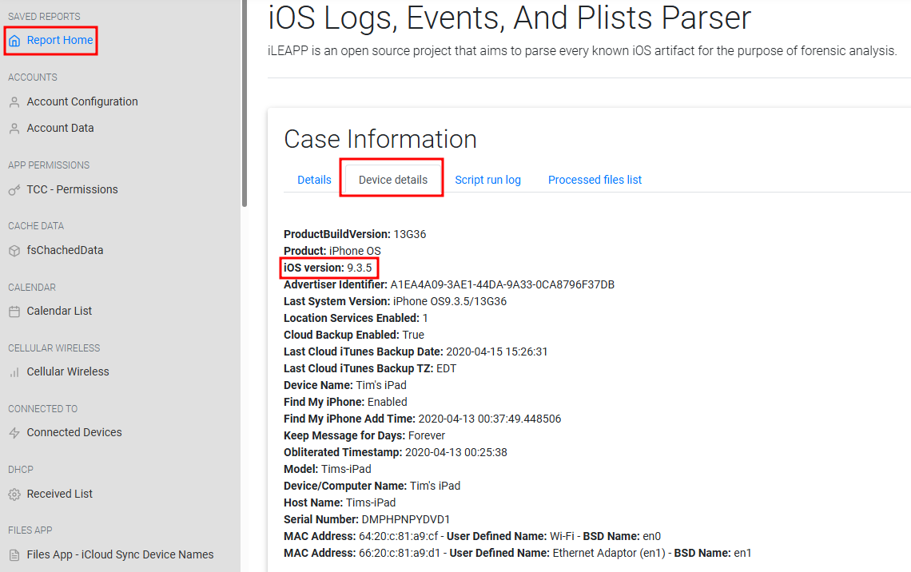
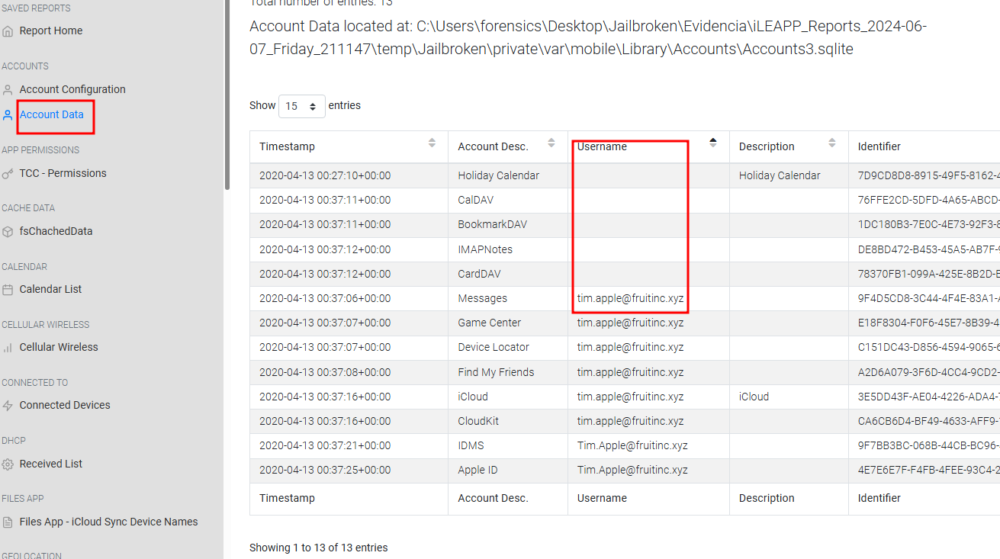
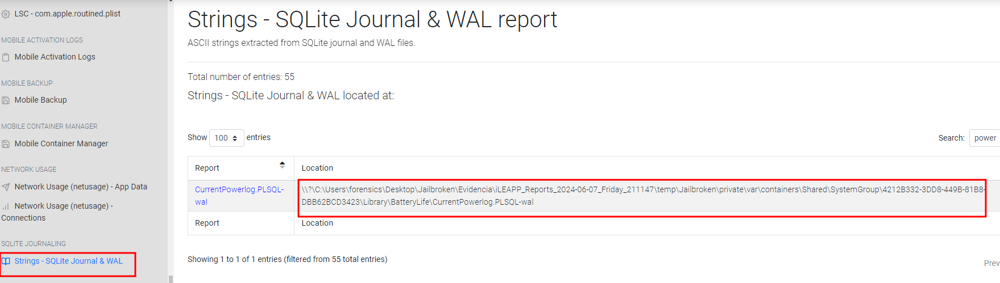
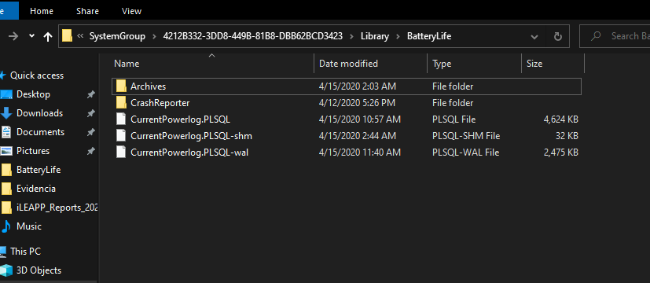

Esta es una guía de cómo resolver, paso a paso, el reto Jailbroken de la plataforma Cyberdefenders.org

Tags: Writeups, Writeups Español, Cyberdefenders, Jailbroken, Endpoint Forensics


# Índice

1. [Preámbulo](#pre)\\
    1.1 [Mitre ATT&CK](#mitre)
2. [Writeup](#wu)\\
    2.1 [Pregunta 1](#p1)\\
    2.2 [Pregunta 2](#p2)\\
    2.3 [Pregunta 3](#p3)\\
    2.4 [Pregunta 4](#p4)\\
    2.5 [Pregunta 5](#p5)\\
    2.6 [Pregunta 6](#p6)\\
    2.7 [Pregunta 7](#p7)\\
    2.8 [Pregunta 8](#p8)\\
    2.9 [Pregunta 9](#p9)\\
    2.10 [Pregunta 10](#p10)\\
    2.11 [Pregunta 11](#p11)\\
    2.12 [Pregunta 12](#p12)\\
    2.13 [Pregunta 13](#p13)\\
    2.14 [Pregunta 14](#p14)\\
    2.15 [Pregunta 15](#p15)\\
    2.16 [Pregunta 16](#p16)\\
    2.17 [Pregunta 17](#p17)
3. [Preguntas y respuestas](#pyr)


# Preámbulo <a name="pre"></a>

<html>
<body>
<style>
table, th, td {
  border:1px solid black;
}
</style>
</body>
</html>

|Info|Descripción|
|:--:|:---------:|
|Reto|Jailbroken|
|SHA1SUM|67b2d3bb549e32727b126232b8c862a3e7816bd0|
|Autor|Champlain College|
|Tags|Disk Forensics, iOS, iPad, iLEAPP, SQLite Browser, Mac, Autopsy, Jailbroken, T1555|

Este laboratorion me hace especial ilusión hacer. Principalmente porque, en nuestros días, los teléfonos celulares y otros dispositivos móviles como tablets (iPads) contienen muchísima información sobre nosotros los usuarios. En casos criminales de cualquier naturaleza, estos dispositivos son una pieza de evidencia probatoria de vital importancia. Por esta razón, y por motivos de gustos personales, me emociona hacer ejecicios sobre dispositivos móviles. El ejercicio en sí, está planteado como tal, no tiene un contexto ficticio de crimen o lo que sea... ya lo verás en la descripción del escenario.

Por otra parte, las herramientas que nos proponen para el ejercicio parecen ser muy buenas. Estas son las joyas que nos regalan hacer ejercicios.


# Escenario

Jailbroken es un caso de investigación de un iPad que expone diferentes aspectos de sistemas iOS donde podrás evaluar tus habilidades forenses y de investigador de sistemas operativos que casos de investigación típicos como miembro de un Blue Team.


## Herramientas

**Recomendadas**
- iLEAPP
- Autopsy
- mac_apt
- SQLiteDB Browser


## Mitre ATT&CK <a name="mitre"></a>

Como ya es habitual en este blogv-y no deja de ser una buena práctica-, siempre que nos dan un código de la matriz de Mitre ATT&CK nos vamos a ir de file a investigar qué nos dice la web al respecto.

[T1555](https://attack.mitre.org/techniques/T1555/)

El ataque nos hace referencia a un **robo de credenciales desde repositorios de constraseñas**. La descrición del ataque nos dice: "Los adversarios pueden buscar ubicaciones comunes de almacenamiento de contraseñas para obtener credenciales de usuario. Las contraseñas se almacenan en varios lugares en un sistema, dependiendo del sistema operativo o la aplicación que contenga las credenciales. También hay aplicaciones y servicios específicos que almacenan contraseñas para facilitar su gestión y mantenimiento por parte de los usuarios, como los gestores de contraseñas y los almacenes de secretos en la nube. Una vez que se obtienen las credenciales, se pueden utilizar para realizar movimientos laterales y acceder a información restringida."


++++++++++++++++++++++++++++++++++++++++++++++++++++++++++++++++++++++++++++++++++++++++++++++++++++++++++++++++++


# Writeup <a name="wu"></a>

El primer paso que voy a hacer es procesar nuestra evidencia con las herramientas propuestas. Dado que no sé qué es lo que me voy a encontrar, vale la pena echarle un ojo a los resultados para empezar a vislumbrar por dónde iniciar. Además, todo sea dicho, la interfaz de usuario de herramientas como iLEAPP es maravillosa.


**1. ¿Cuál es la versión de iOS de este dispositivo?** <a name="p1"></a>

Usando la herramienta iLLEAPP, y siendo afortunados que esta información se encuentra fácil, la versión del sistema operativo, como se puede ver en el “html” que devuelve la herramienta, es la “9.3.5”. Esta información la encuentras en la sección de “Report Home” y, luego, en “Device Details”.




**2. ¿Quién está usando el iPad? Incluye su nombre y apellido.** <a name="p2"></a>

En la misma sección que la pregunta anterior podemos ver el nombre del dispositivo, sin embargo, eso no es lo que estamos buscando. En la sección de “Account Data” vemos una columna de “Username” y esa en nuestra respuesta: “Tim Apple”.




**3. ¿Cuándo fue la última vez que este dispositivo estuvo cargado al 100%?** <a name="p3"></a>

Para esta pregunta tardé bastante tiempo porque estaba haciendo mal las cosas. Les voy a  mencionar lo que estaba haciendo por si les sirve de referencia.

En el browser del iLEAPP hay una sección llamada “Strings - SQLite Journal & WAL”. Allí empecé a buscar referencias a alguna base de datos de logs de la batería del dispositivo y encontré lo que enseñó en la siguiente imagen:



Ese fichero es el que estamos buscando pero con la diferencia de que, con la extensión “tal” parece que se necesitan otros ficheros para poder leer la base de datos; de lo contrario con el SQLite Browser dará error para leer el archivo. Esto es así porque buscar ese archivo en el output parseado del iLEAPP no ofrece los ficheros necesarios para poder leer la base de datos. Entonces, lo que hay que hacer es buscar ese fichero en la evidencia original, el cual se encuentra en la siguiente ruta:

```
\private\var\containers\Shared\SystemGroup\4212B332-3DD8-449B-81B8-DBB62BCD3423\Library\BatteryLife\
```

Y allí encontrarás los siguiente ficheros, desde el SQLite Browser importa el que se llama “CurrentPowerlog.PLSQL” desde esa carpeta para que se parsee la información de manera correcta:



Una vez importada la base de datos, hay que leer la base que se llama “PLBatteryAgent_EventBackward_Battery” y encontrar el evento con ID 1867:

[jailbroken](../assets/img/jailbroken/5.png)

Hay que convertir en timestemp a un formato legible. Yo lo hice desde la web de

```
epochconverter.com
```

Desde allí convertirnos el formato, sin poner en la sección correspondiente los decimales y allí tenemos nuestra respuesta:

[jailbroken](../assets/img/jailbroken/6.png)


**4. ¿Cuál es el título de la página web que se vio más veces?** <a name="p4"></a>

Para responder a esta pregunta, usé el DB Browser de SQLite. Extraje la base de datos “History” del historial de búsqueda de Safari desde la siguiente ruta:

```
ruta_al_parse\temp\Jailbroken\private\var\mobile\Containers\Data\Application\FB1B2A1C-AC19-406F-BEEC-EC048BF504EA\Library\Safari
```

Allí puedes ver que el término de búsqueda al que más se accedió fue “Kirby with legs”:

[jailbroken](../assets/img/jailbroken/7.png)


**5. ¿Cuál es el título del primer podcast que se descargó?** <a name="p5"></a>

Para responder a esta pregunta, usé un poco de intuición pues supuse que cualquier archivo descargado aparecería en alguna carpeta llamada “media” y encontré una carpeta dedicada para la app de Podcast en la siguiente ruta:

```
private\var\mobile\Media\Podcast
```

Allí encontré varios archivos. Traté de leer la información asociada a estos ficheros y me di cuenta que la información sobre los podcasts descargados se encuentra en los ficheros que no tienen extensión. Sólo abrí esos ficheros desde le navegador (arrastrándolos) y allí encontré la respuesta. El fichero asociado a nuestra respuesta es el “1174163024052164360”:

[jailbroken](../assets/img/jailbroken/8.png)


**6. ¿Cuál es el nombre de la red WiFi a la que se conectó este dispositivo?** <a name="p6"></a>

Regresamos al iLEAPP, allí verás una sección de “WiFi Known Networks” y así de simple podrás ver el nombre de la red:

[jailbroken](../assets/img/jailbroken/9.png)


**7. ¿Cuál es el nombre de la piel/esquema de color usado para el emulador de juegos? Debe ser un nombre de archivo.** <a name="p7"></a>

Una vez sabiendo que el emulador que estaba usando en el dispositivo se llama “GBA4iOS”, seguí explorando las carpetas de nuestra evidencia y encontré una llamada “Applications” y allí hay una dedicada a este emulador. Allí encontré el nombre de dos skins y nuestra respuesta es la “Default.gbaskin”:

[jailbroken](../assets/img/jailbroken/10.png)


**8. ¿Cuánto tiempo estuvo ejecutándose la aplicación de Noticias en segundo plano?** <a name="p8"></a>

Regresando a las bases de datos de journal “CurrentPowerlog”, encontramos una base de datos que se llama “PLAppTimeService_Aggregate_AppRunTime”. Si filtramos en la sección de “BundeID” por “news” veremos nuestra respuesta:

[jailbroken](../assets/img/jailbroken/11.png)


**9. ¿Cuál fue la primera aplicación descargada desde la AppStore?** <a name="p9"></a>

En la sección de “Installed Apps” en el reporte de iLLEAPP, veremos que la primera aplicación instalada fue “Cookie Run”.

[jailbroken](../assets/img/jailbroken/12.png)


**10. ¿Qué aplicación se utilizó para hacer jailbreak a este dispositivo?** <a name="p10"></a>

Regresando al reporte de iLEAPP, busqué en todas las aplicaciones instaladas en el dispositivo (sección “Application State DB”) esperando encontrar una que me pareciera extraña y encontré una que no me sonaba el nombre: Phoenix. Esto lo pudo conformar simplemente googleando “phoenix ipad jailbrake”:

[jailbroken](../assets/img/jailbroken/13.png)

[jailbroken](../assets/img/jailbroken/14.png)


**11. ¿Cuántas aplicaciones fueron instaladas desde la AppStore?** <a name="p11"></a>

Esta respuesta es sencilla pues en el mismo reporte, en la sección de “Apps - iTunes Metadata” encontramos sólo dos aplicaciones instaladas:

[jailbroken](../assets/img/jailbroken/15.png)


**12. ¿Cuántos estados guardados se hicieron para el juego del emulador que se obtuvo más recientemente?** <a name="p12"></a>

En la carpeta de Documents en la ruta

```
private\var\mobile\Documents
```

Podemos ver que hay dos juegos instaladas: “Pokémon” y “Zelda”. Hay una carpeta de nombre “Save States” y dentro veremos sólo dos carpetas. Asumí que cada guardado generaría una carpeta y parece ser que sí, de esta manera que nuestra respuesta es: 1.


**13. ¿Qué idioma está tratando de aprender el usuario?** <a name="p13"></a>

Retomando la respuesta de la pregunta 5, uno de los dos podcasts descargados era de Duolingo que es en idioma español, así que nuestra respuesta es: spanish.

[jailbroken](../assets/img/jailbroken/16.png)


**14. El usuario estaba leyendo un libro en la vida real pero usó su iPad para registrar la página en la que se quedó. ¿Cuál era el número?** <a name="p14"></a>

Lo más sensato era buscar en la aplicación de notas nativa del dispositivo que podemos encontrar en la siguiente ruta; pero les adelanto que no hay nada interesante allí:

[jailbroken](../assets/img/jailbroken/17.png)

Lo siguiente que se me vino a la cabeza fue que estuviera usando fotos para guardar la página en la que paró de leer. La forma más rápida de acceder a las imágenes es con el Autopsy, pero en imágenes tampoco veremos nada. Resulta que nuestra respuesta está en un vídeo nombrado “IMG_0008.MOV” y es la página: 85.

[jailbroken](../assets/img/jailbroken/18.png)


**15. Si me encontraste, ¿qué debería comprar?** <a name="p15"></a>

Esta respuesta es difícil. Lo primero que hice fue abrir la sección de “Databases” en el Autopsy y buscar una base de datos que resultara relevante mediante palabras clave y encontré una que se llama “NoteStore.sqlite”.

[jailbroken](../assets/img/jailbroken/19.png)

La abrí desde el Browser pero no vi nada relevante allí. Así que, una vez que la extraje a una carpeta de evidencia, usé el comando strings para buscar la palabra “buy” y allí encontramos nuestra respuesta: Crash Bandicoot Nitro-Fueled Racing

[jailbroken](../assets/img/jailbroken/20.png)


**16. Había una aplicación de SMS en el dock de este dispositivo.** <a name="p16"></a>

Esta también es una de las respuestas difíciles. Estuve buscando un rato en la lista de Plugins del dispositivo en búsqueda de la aplicación que gestione el Dock del iPad hasta que encontré una llamada “SpringBoard” la cual, según WikiPedia, es la que gestionaba el dock desde la versión 7 del sistema operativo. La carpeta de esta aplicación se encuentra en:

```
private\var\mobile\Library\SpringBoard
```

Allí encontramos un plist llamado “IconState” el cual es bastante sugerente para lo que estamos buscando:

[jailbroken](../assets/img/jailbroken/21.png)


**17. Se hizo un recordatorio para conseguir algo, ¿qué fue?** <a name="p17"></a>

En la aplicación de Calendario hay bases de datos. Hay que importarlas como el caso de la base de datos de información de la batería. Una vez en el Browser hay que abrir “CalendarItem” y allí veremos nuestra respuesta:

[jailbroken](../assets/img/jailbroken/22.png)

++++++++++++++++++++++++++++++++++++++++++++++++++++++++++++++++++++++++++++++++++++++++++++++++++++++++++++++++++

# Preguntas y respuestas <a name="pyr"></a>

Aquí tienes las traducciones de las preguntas:

1. ¿Cuál es la versión de iOS de este dispositivo?\\
**9.3.5**

2. ¿Quién está usando el iPad? Incluye su nombre y apellido.\\
**Tim Appple**

3. ¿Cuándo fue la última vez que este dispositivo estuvo cargado al 100%?\\
**04/15/2020 06:40:31 PM**

4. ¿Cuál es el título de la página web que se vio más veces?\\
**kirby with legs**

5. ¿Cuál es el título del primer podcast que se descargó?\\
**where are we?**

6. ¿Cuál es el nombre de la red WiFi a la que se conectó este dispositivo?\\
**black lab**

7. ¿Cuál es el nombre de la piel/esquema de color usado para el emulador de juegos? Debe ser un nombre de archivo.\\
**Default.gbaskin**

8. ¿Cuánto tiempo estuvo ejecutándose la aplicación de Noticias en segundo plano?\\
**197.810275**

9. ¿Cuál fue la primera aplicación descargada desde la AppStore?\\
**Cookie run**

10. ¿Qué aplicación se utilizó para hacer jailbreak a este dispositivo?\\
**Phoenix**

11. ¿Cuántas aplicaciones fueron instaladas desde la AppStore?\\
**2**

12. ¿Cuántos estados guardados se hicieron para el juego del emulador que se obtuvo más recientemente?\\
**1**

13. ¿Qué idioma está tratando de aprender el usuario?\\
**Spanish**

14. El usuario estaba leyendo un libro en la vida real pero usó su iPad para registrar la página en la que se quedó. ¿Cuál era el número?\\
**85**

15. Si me encontraste, ¿qué debería comprar?\\
**Crash Bandicoot Nitro-Fueled Racing**

16. Había una aplicación de SMS en el dock de este dispositivo.\\
**com.apple.MobileSMS**

17. Se hizo un recordatorio para conseguir algo, ¿qué fue?\\
**milk**

