Esta es una guía de cómo resolver, paso a paso, el reto LGDroid de la plataforma Cyberdefenders.org

Tags: Writeups, Writeups Español, Cyberdefenders, LGDroid


# Índice

1. [Preámbulo](#pre)\\
   1.1 [Mitre ATT&CK](#mitre)
2. [Writeup](#wu)\\
    2.1 [Pregunta 1](#p1)\\
    2.2 [Pregunta 2](#p2)\\
    2.3 [Pregunta 3](#p3)\\
    2.4 [Pregunta 4](#p4)\\
    2.5 [Pregunta 5](#p5)\\
    2.6 [Pregunta 6](#p6)\\
    2.7 [Pregunta 7](#p7)\\
    2.8 [Pregunta 8](#p8)
3. [Preguntas y respuestas](#pyr)


# Preámbulo <a name="pre"></a>

<html>
<body>
<style>
table, th, td {
  border:1px solid black;
}
</style>
</body>
</html>

|Info|Descripción|
|:--:|:---------:|
|Reto|LGDroid|
|SHA1SUM|a371b440d029267e95dbff243d0283b87deb4fd1|
|Autor|DFIRScience|
|Tags|Disk Forensic, Android, SQLite Browser, T1426, T1420, T1552, T1600, T1512, T1550.002, T1601|

|Herramientas recomendadas|
|:----------------------:|
|SQLite Browser|
|Epoch Converter|

|Herramientas usadas|
|:-----------------:|
|SQLite Browser|
|Epoch Converter|
|pyssim|


# Escenario

Nuestro equipo de Respuesta de Incidentes hizo un volcado de disco del teléfono Android. Como analista SOC, analiza el volcado y responde las preguntas proporcionadas.


# Mitre ATT&CK <a name="mitre"></a>

[T1420](https://attack.mitre.org/techniques/T1420/)

**Descubrimiento de Archivos y Directorios**

Los adversarios pueden enumerar archivos y directorios o buscar en ubicaciones específicas del dispositivo la información deseada dentro de un sistema de archivos. Los adversarios pueden usar la información del Descubrimiento de Archivos y Directorios durante el descubrimiento automatizado para moldear comportamientos posteriores, incluyendo decidir si el adversario debe infectar completamente el objetivo y/o intentar acciones específicas.

En Android, los permisos de archivos de Linux y las políticas de SELinux típicamente restringen estrictamente lo que puede ser accedido por aplicaciones sin aprovechar una explotación de escalamiento de privilegios. El contenido del directorio de almacenamiento externo generalmente es visible, lo que podría presentar preocupaciones si datos sensibles se almacenan inapropiadamente allí. La arquitectura de seguridad de iOS generalmente restringe la capacidad de realizar cualquier tipo de Descubrimiento de Archivos y Directorios sin el uso de privilegios elevados.

[T1426](https://attack.mitre.org/techniques/T1426/)

**Descubrimiento de Información del Sistema**

Los adversarios pueden intentar obtener información detallada sobre el sistema operativo y el hardware de un dispositivo, incluyendo versiones, parches y arquitectura. Los adversarios pueden usar la información del Descubrimiento de Información del Sistema durante el descubrimiento automatizado para moldear comportamientos posteriores, incluyendo decidir si infectar completamente el objetivo y/o intentar acciones específicas.

En Android, mucha de esta información es accesible programáticamente para las aplicaciones a través de la clase android.os.Build iOS es mucho más restrictivo con la información que es visible para las aplicaciones. Típicamente, las aplicaciones solo podrán consultar el modelo del dispositivo y la versión de iOS que está ejecutando.

[T1512](https://attack.mitre.org/techniques/T1512/)

**Captura de Video**

Un adversario puede aprovechar las cámaras de un dispositivo para recopilar información capturando grabaciones de video. También se pueden capturar imágenes, potencialmente en intervalos especificados, en lugar de archivos de video.

El malware o los scripts pueden interactuar con las cámaras del dispositivo a través de una API disponible proporcionada por el sistema operativo. Los archivos de video o imágenes pueden ser escritos en el disco y exfiltrados posteriormente. Esta técnica difiere de la Captura de Pantalla debido al uso de las cámaras del dispositivo para la grabación de video en lugar de capturar la pantalla de la víctima.

En Android, una aplicación debe tener el permiso android.permission.CAMERA para acceder a las cámaras. En iOS, las aplicaciones deben incluir la clave NSCameraUsageDescription en el archivo Info.plist. En ambos casos, el usuario debe otorgar permiso a la aplicación solicitante para usar la cámara. Si el dispositivo ha sido rooteado o jailbreakeado, un adversario puede acceder a la cámara sin el conocimiento del usuario.

[T1552](https://attack.mitre.org/techniques/T1552/)

**Credenciales No Seguras**

Los adversarios pueden buscar en sistemas comprometidos para encontrar y obtener credenciales almacenadas de forma insegura. Estas credenciales pueden estar almacenadas y/o mal ubicadas en muchos lugares de un sistema, incluyendo archivos en texto plano (por ejemplo, Historial de Bash), repositorios específicos del sistema operativo o de aplicaciones (por ejemplo, Credenciales en el Registro), u otros archivos/artifactos especializados (por ejemplo, Claves Privadas).

[T1552.002](https://attack.mitre.org/techniques/T1552/002/)

**Credenciales No Seguras: Credenciales en el Registro**

Los adversarios pueden buscar en el Registro de sistemas comprometidos para encontrar credenciales almacenadas de forma insegura. El Registro de Windows almacena información de configuración que puede ser utilizada por el sistema u otros programas. Los adversarios pueden consultar el Registro buscando credenciales y contraseñas que han sido almacenadas para uso por otros programas o servicios. A veces, estas credenciales se utilizan para inicios de sesión automáticos.

Ejemplos de comandos para encontrar claves de Registro relacionadas con información de contraseñas:

Hive de Máquina Local:
```
reg query HKLM /f password /t REG_SZ /s
```

Hive de Usuario Actual:
```
reg query HKCU /f password /t REG_SZ /s
```

[T1600](https://attack.mitre.org/techniques/T1600/)

**Debilitar la Cifrado**

Los adversarios pueden comprometer la capacidad de cifrado de un dispositivo de red para evitar el cifrado que, de otro modo, protegería las comunicaciones de datos.

El cifrado se puede usar para proteger el tráfico de red transmitido y mantener su confidencialidad (proteger contra divulgaciones no autorizadas) e integridad (proteger contra cambios no autorizados). Los cifrados de cifrado se utilizan para convertir un mensaje en texto plano a texto cifrado y pueden ser intensivos en términos computacionales para descifrar sin la clave de descifrado asociada. Típicamente, las claves más largas aumentan el costo de la criptoanálisis, o el descifrado sin la clave.

Los adversarios pueden comprometer y manipular dispositivos que realizan el cifrado del tráfico de red. Por ejemplo, a través de comportamientos como Modificar la Imagen del Sistema, Reducir el Espacio de Claves y Deshabilitar el Hardware de Criptografía, un adversario puede afectar negativamente y/o eliminar la capacidad de un dispositivo para cifrar de manera segura el tráfico de red. Esto presenta un mayor riesgo de divulgación no autorizada y puede ayudar a facilitar la manipulación de datos, el acceso a credenciales o los esfuerzos de recolección.

[T1601](https://attack.mitre.org/techniques/T1601/)

**Modificar la Imagen del Sistema**

Los adversarios pueden hacer cambios en el sistema operativo de dispositivos de red integrados para debilitar las defensas y proporcionarse nuevas capacidades. En estos dispositivos, los sistemas operativos son típicamente monolíticos y la mayoría de la funcionalidad y capacidades del dispositivo están contenidas dentro de un solo archivo.

Para cambiar el sistema operativo, el adversario típicamente solo necesita afectar este único archivo, reemplazándolo o modificándolo. Esto se puede hacer en vivo en la memoria durante el tiempo de ejecución del sistema para un efecto inmediato, o en el almacenamiento para implementar el cambio en el próximo arranque del dispositivo de red.

++++++++++++++++++++++++++++++++++++++++++++++++++++++++++++++++++++++++++++++++++++++++++++++++++++++++++++++++++

# Writeup <a name="wu"></a>


**1. ¿Cuál es la dirección de correo electrónico de Zoe Washburne?** <a name="p1"></a>

Para responder esta pregunta hay que encontrar el fichero “conctacs3” el cual podemos abrir con el SQLite Browser. Allí encontraremos unas serie de correos electrónicos donde se encuentra el nuestro:

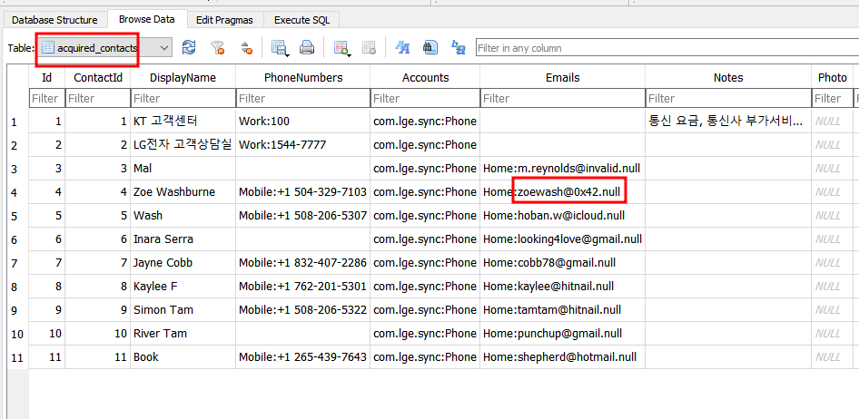


**2. ¿Cuál era la hora del dispositivo en UTC en el momento de la adquisición?**  <a name="p2"></a>

El fichero que contiene esta información se encuentra en la siguiente ruta dentro del directorio “Live Fata”. Se trata del fichero con nombre “device_datetime”:

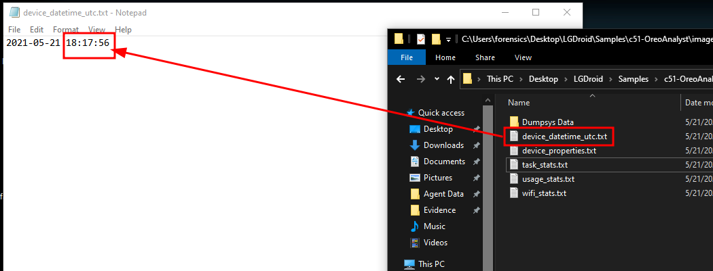


**3. ¿A qué hora se descargó el navegador Tor en UTC?**  <a name="p3"></a>

En la misma carpeta donde encontramos el fichero de contacts veremos uno llamado “downloads”. Si lo abrimos con el SQLIie veremos la columna de “Lastmod”, pero la información de descarga está en formato epoch que debemos convertir a uno leíble para nosotros. Yo usé la web de epochtimeteamp y allí tenemos nuestra respuesta:

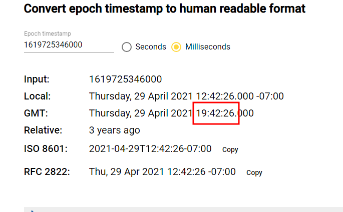


**4. ¿A qué hora se cargó el teléfono al 100% después del último reinicio?**  <a name="p4"></a>

Para contestar esta pregunta, hay que dirigirse a la siguiente ruta

```
Live Data\Dumpsys Data\
```

Y allí hallaremos un fichero txt llamado “batterystats”. Una vez dentro, podremos ver la información desde el último reinicio del dispositivo:

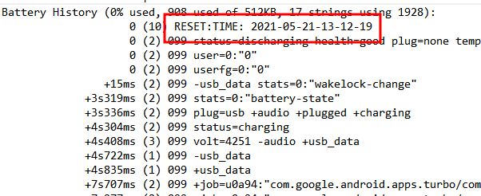

La hora del reinicio fue a las 13:12:19. Luego, si bajamos en la información disponible, veremos que la última vez que la batería se cargó al máximo desde el último reinicio fue 5 minutos y 1 segundo después de este reinicio. Por lo que la respuesta es: 13:17:20.

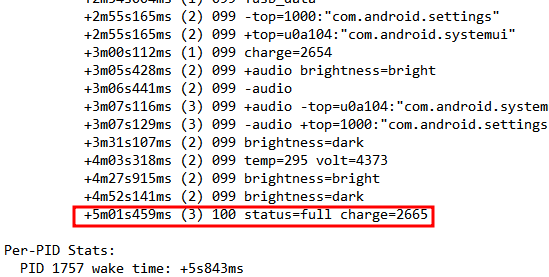


**5. ¿Cuál es la contraseña del punto de acceso WIFI al que se conectó más recientemente?**  <a name="p5"></a>

Por lo que pude en encontrar en internet, la información almacenada sobre las conexiones wifi se almacena en la siguiente ruta del dispositivo:

```
apps\com.android.providers.settings\k\
```

Donde encontraremos un fichero de nombre “com.android.providers.settings.data” sobre el cual hay que  ver la información al interior de este fichero. Una vez hagamos esto, podremos ver una línea con la contraseña:

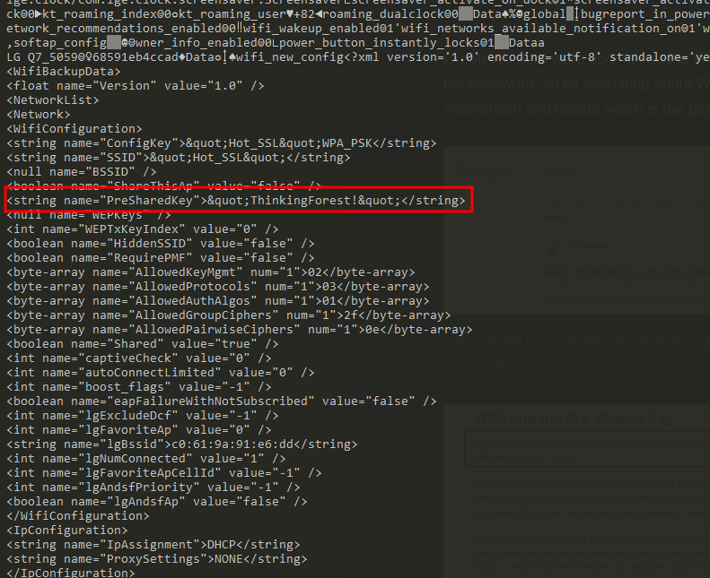


**6. ¿Qué aplicación estaba usando el usuario a las 2021-05-20 14:13:27?**  <a name="p6"></a>

En la carpeta de “Live Data” hay un fichero txt que se llama “usage_stats”, el cual es bastante explícito en la información que podría contener. Usando los comandos “cat” y “grep” de Linux veremos que la aplicación que el usuario estaba usando en ese momento era YouTube:

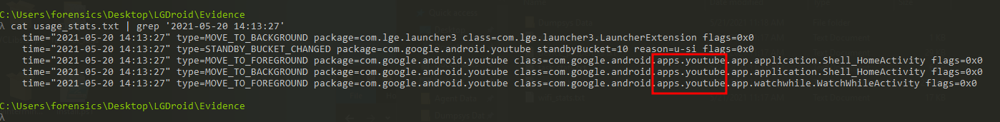


**7. ¿Cuánto tiempo vio el sospechoso YouTube el 2021-05-20?**  <a name="p7"></a>

Supuse que esta respuesta estaría en el mismo fichero así que me puse a explorarlo dado que la última línea del output dice “WatchWhileActivity” y efectivamente allí está nuestra respuestas:

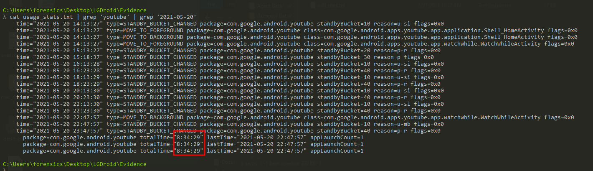

La cuestión con esta pregunta es que, aparentemente, hay milisegundos de diferencia entre el resultado de que nos da el fichero y la diferencia de horas entre las 14:13:27 y la última hora de ejecución 22:47:57. De tal manera que nuestra respuesta es “08:34:30”.


**”8. suspicious.jpg: ¿Cuál es la métrica de similitud estructural para esta imagen en comparación con una imagen visualmente similar tomada con el teléfono móvil?**  <a name="p8"></a>

Para esta pregunta hay dos cosas tenemos que resolver antes: (1) entender qué son las métricas de similitud y encontrar la misma imagen dentro del sistema de ficheros que, muy probablemente, tenga un nombre distinto.

(1) La IA del navegador de Brave nos dice que las métricas de similitud de imágenes son algo como lo siguiente: “Las métricas de similitud de imágenes son algoritmos y técnicas utilizadas para evaluar la calidad y la similitud entre dos o más imágenes. Estas métricas son fundamentales en la compresión de imágenes, la restauración de imágenes, la detección de cambios y la clasificación de imágenes.

Índice de Similitud Estructural (SSIM)
El Índice de Similitud Estructural (SSIM) es una métrica común utilizada para evaluar la calidad de una imagen. SSIM calcula la similitud entre dos imágenes en base a la estructura y la textura de las imágenes. Un valor más cercano a 1 indica una mejor calidad de imagen”.

Ya tenemos que hay un índice para comparar entre dos imágenes. Ahora falta encontrar nuestra otra imagen igual que la “suspicious”. Lo que debemos hacer para buscar algo es tener un parámetro.  Lo que estamos buscando podría encontrarse en los metadatos de la imagen que ya tenemos reconocida:

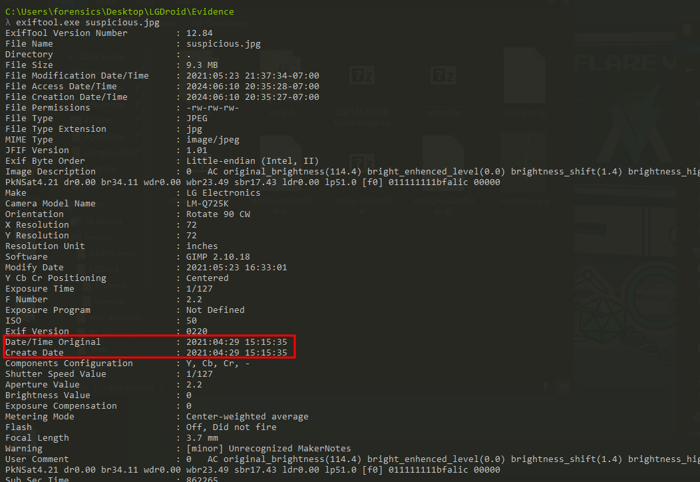

Vamos a tomar la fecha de creación como nuestro parámetro. Así, pues, ahora tenemos que buscar todas las imágenes jpg dentro del sistema de fichero y ver cómo están almacenadas. Lo primero que hice fue listar los archivos jpg del sdcard.tar.gz en modo verbose con el siguiente comando:

```
tar -tvf sdcard.tar.gz | grep jpg
```

El salida por pantalla dio lo siguiente:

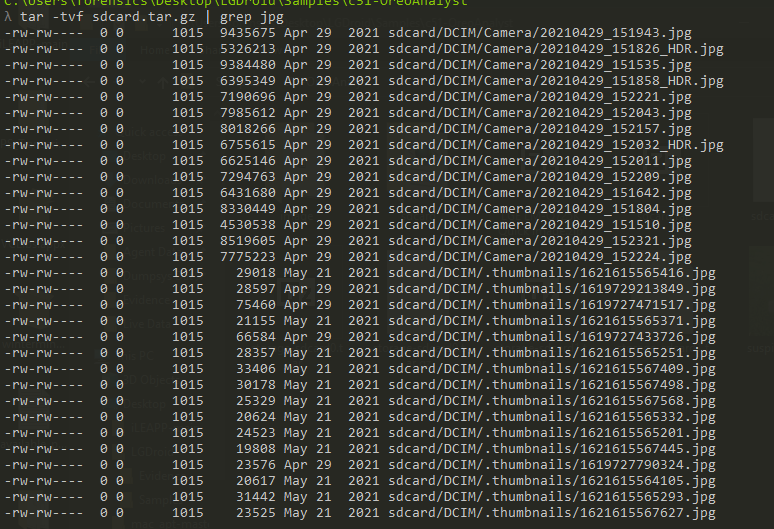

Nos arroja la fecha de creación lo cual coincide con lo que encontramos en los metadatos de nuestra imagen muestra: 29 de abril del 2021. Como puedes ver en la imagen anterior, hay varias imágenes de ese día, sin embargo, en el nombre de la imagen como se almacena por defecto nos da la hora de creación y allí podemos ver que la imagen que nos interesa acaba en “151535.jpg”. Ahora toca extraer esa imagen y el comando tar nos da esa opción con el siguiente comando:

```
tar -xvf sdcard.tar.gz sdcard/DCIM/Camera/20210429_151535.jpg
```

Encontré que hay un módulo de python que nos calcula el índice de similitud estructural (SSIM) entre dos imágenes. Para instalarlo en mi entorno de la terminal fue:

```
py -m pip install pyssim
```

Una vez instalado solamente hay que correr el pyssim imagen_original imagen_a_comparar y el índice que no arroja es el siguiente:

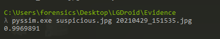

Nuestra respuesta es: 0.99.

++++++++++++++++++++++++++++++++++++++++++++++++++++++++++++++++++++++++++++++++++++++++++++++++++++++++++++++++++

# Preguntas y respuestas <a name="pyr"></a>

¿Cuál es la dirección de correo electrónico de Zoe Washburne?\\
**zoewash@0x42.null**

¿Cuál era la hora del dispositivo en UTC en el momento de la adquisición?\\
**18:17:56**

¿A qué hora se descargó el navegador Tor en UTC?\\
**19:42:26**

¿A qué hora se cargó el teléfono al 100% después del último reinicio?\\
**13:17:20**

¿Cuál es la contraseña del punto de acceso WIFI al que se conectó más recientemente?\\
**ThinkingForest!**

¿Qué aplicación estaba usando el usuario a las 2021-05-20 14:13:27?\\
**youtube**

¿Cuánto tiempo vio el sospechoso YouTube el 2021-05-20?\\
**08:34:30**

"suspicious.jpg: ¿Cuál es la métrica de similitud estructural para esta imagen en comparación con una imagen visualmente similar tomada con el teléfono móvil?\\
**0.99**