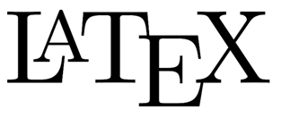

# CV

## *Ulises Aroche*

---

### Información Académica 

+ > **Maestría** en Filosofía de la Ciencia

    Universidad Nacional Autónoma de México. Facultad de Filosofía y Letras / Unidad de Posgrado.
    Promedio 9.40, mención honorífica.
    
    Fecha de titulación: 30 de septiembre de 2021.
    
    Modalidad de titulación: Tesis. Título: "Modelos económicos teóricos y causalidad". [Revisar en Tesis Unam](http://132.248.9.195/ptd2021/julio/0813587/Index.html).

 

+ > **Licenciatura** en Economía

    Universidad Nacional Autónoma de México. Facultad de Economía. Promedio 9.10, mención honorífica. Fecha de titulación: 18 de enero de 2019.

    Aptitudes adquiridas: manejo de Excel, recopilación de datos estadísticos, presentación de información estadística en gráficos y tablas.

    Modalidad de titulación: Tesis. Título: "La relación entre inflación y desempleo por sexo en la Zona Euro: La política monetaria del BCE de 1996 a 2016". [Revisar en Tesis Unam](http://132.248.9.195/ptd2018/octubre/0781703/Index.html).

 

+ > **Licenciatura** en Filosofía

    Universidad Nacional Autónoma de México. Facultad de Filosofía y Letras.
    Promedio parcial 9.40.
    Trunca, hasta 5 semestre.
    
    Aptitudes adquiridas: análisis lógico de argumentos, análisis epistemológico de textos, síntesis y elaboración de textos.

---

---

### Aptitudes Generales

<<<<<<< HEAD
*Habilidades* 
=======
*Habilidades* 
>>>>>>> 4b6c3fbcb6362c258ebf01a1b84c822eec55a9de

+ > **Excel** Nivel Medio.

+ > **Paquetería Office** Word, Excel, PowerPoint, Visio.

+ > **Análisis** y realización de textos profesionales, ejecutivos, elaboración de reportes y desarrollo de investigaciones.

+ > **LaTex** para informes y textos con lenguaje formal.

 

*Idiomas*

+ > **Inglés** Nivel medio. Competencia principal: lectura. Certificación de comprensión lectora por la Escuela Nacional de Lenguas, Lingüística y Traducción (ENALLT), UNAM.

+ > **Francés** Nivel medio. Competencia principal: lectura. Certificación de comprensión lectora por la Escuela Nacional de Lenguas, Lingüística y Traducción (ENALLT), UNAM.

 

*Otros*

+ > **Becario** en el proyecto de investigación PAPIIT "Mercados financieros contemporáneos. Crisis, deuda exterior y deflación" con la Dra. Alicia Girón, en el Instituto de Investigaciones Económicas - UNAM de 2015 a 2016.

+ > **Asistente personal** de la Dra. Monika Meireles en el proyecto de investigación PAPIIT "Financiarización, sector bancario y desarrollo: Tendencias y perspectivas". Apoyo en la coordinación de los becarios y servicios social del proyecto en el Instituto de Investigaciones Económicas - UNAM de 2016 a 2017.

+ > **Becario** en el proyecto de investigación PAPIIT "Trascendencia del gasto público en la incorporación de las mujeres al mercado laboral. Trabajo de cuidado y reproducción en América Latina" con la Dra. María Luisa González Marín y la Mtra. Patricia Rodríguez López en el Instituto de Investigaciones Económicas, UNAM de 2018 a 2019.

---

---

### Experiencia Laboral

*Tiempo laborando: 26 meses y corriendo*

* > Tendencias Consultores en Economía, S.C. Analista de proyectos de inversión en el sector rural. De marzo de 2018 a septiembre de 2018: 7 meses.

 

+ > Unión de Crédito para la Contaduría Pública (UniCCo). Área de cobranza:
    + Becario de febrero de 2019 a julio de 2019: 5 meses.
    + Ejecutivo de cobranza de marzo de 2021 a julio de 2021: 4 meses.

 

+ > Grupo Miura. Inteligencia: investigación de siniestros, elaboración de reportes y presentación de evidencia, correlación de hechos y reconstrucción de siniestros desde septiembre de 2021 a la actualidad.

---

---


